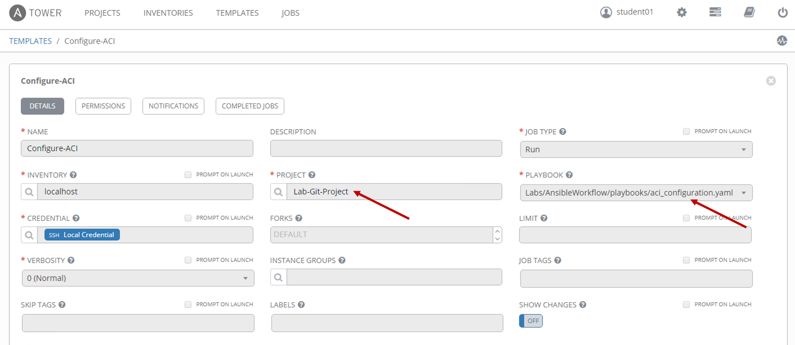
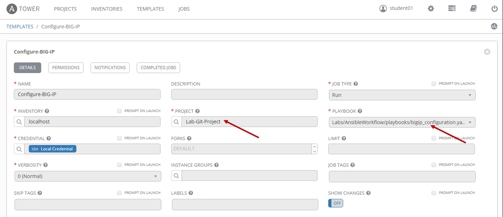
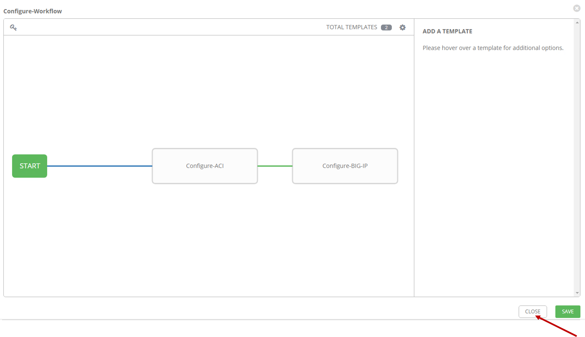
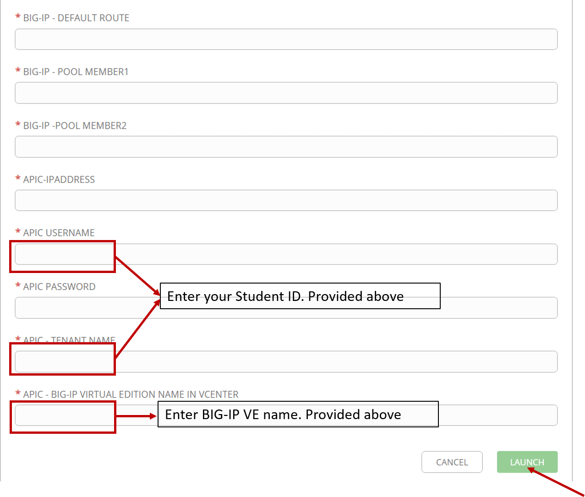
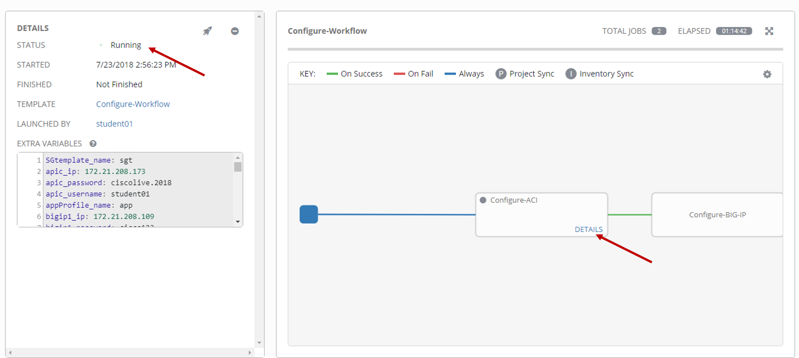
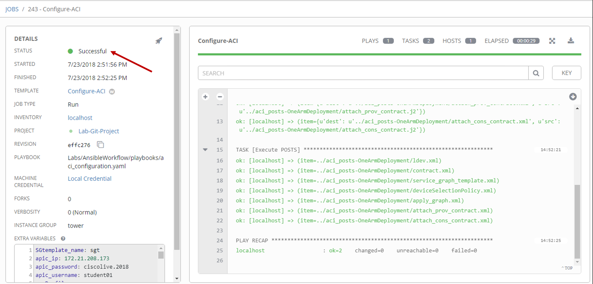

# Lab Exercise 

>**Please note that the images used in the lab guide are representative and NOT based on any specific pod. Please use the information in the lab guide instead.**

Lab will be used to demonstrate L4-L7 service insertion in unmanaged mode to simulate an enterprise network and/or cloud provider’s application delivery offering while allowing the application owner to manage the L4-L7 device using their prefered tool. 

We will use the F5 BIG-IP VE Virtual ADC to demonstrate this functionality.

## Automate configuration on APIC and BIG-IP device using Ansible

We will provision the APIC and BIG-IP using Ansible for a couple of reasons. Ansible is an open source automation platform that can help with configuration management, application deployment, and task automation. It can also do IT orchestration, where you have to run tasks in sequence and create a chain of events which must happen on several different servers or devices.

Red Hat Ansible Tower provides a single point of control your IT infrastructure with a visual dashboard, role-based access control, job scheduling, integrated notifications and graphical inventory management. 

Connect to the Ansible tower using the following information:

* **Ansible Tower Address**: 172.21.208.250
* **username**: {TSTUDENT}
* **password**: cisco123

Once you are logged in click on **Projects** located in the top level menu
Click on **Lab-Git-Project**. This is a view only permission.


The SCM URL defines the Github repo from where the playbooks and other content is being pulled from.


Click on **Templates** located in the top level menu: 

Click on the template **Configure-ACI**
* This is a view only template. This template will not be launched.
* There is a project associated with the template (which is the GIT project).
* There is a ansible playbook associated with the template (pulled from GIT - aci_configuration.yaml).




Scroll down -> Click on the template **Configure-BIG-IP**
* This is a view only template. This template will not be launched.
* There is a project associated with the template (which is the GIT project).
* There is a ansible playbook associated with the template (pulled from GIT - bigip_configuration.yaml).



A workflow has been created in Ansible Tower to chain the execution of the above two playbooks

Scroll down -> Click on the template **Configure-Workflow**. 
This is a workflow template consisting of two playbooks we viewed earlier
1) Configure-ACI
2) Configure-BIG-IP


Click on the 'Workflow Editor' button to view the workflow configured


After viewing 'close' the workflow editor



View the paramters in the **Extra Variables** text box. Values that you provide here will be provided as input to the playbooks in the workflow


Scroll through and make sure the following paramters are specified:

```
#################
#APIC information
#################
consumerBD_name: "vip-bd" 			#Consumer Bridge domain name
providerBD_name: "vip-bd"			#Provider bridge domain name

appProfile_name: "app"				#Application profile name
consumerEPG_name: "epg-l3out"			#Consumer EPG name
providerEPG_name: "web-epg" 			#Provider EPG name

SGtemplate_name: "sgt"				#Service graph template name
contract_name: "cntr"				#Contract name

logicalDeviceCluster_name: "bigip"		#Logical Device Cluster name

#################
#BIG-IP information
#################

vlan_information:
- name: "VLAN"
  id: "1234"					#Vlan ID
  interface: "1.1"  				#Interface on BIG-IP to which the VLAN is untagged

bigip_selfip_information:
- name: 'SelfIP'
  address: '69.2.101.10'			#Self-IP address
  netmask: '255.255.255.0'  
  vlan: "{{vlan_information[0]['name']}}"	#VLAN to be assinged to the BIG-IP

static_route:
- name: "default"
  gw_address: "69.2.101.1"			#Default gateway assigned on the BIG-IP
  destination: "0.0.0.0"
  netmask: "0.0.0.0"

pools:
- pool_name: "http-pool"			#Pool name
  pool_members:					#Members belonging to the BIG-IP Pool
   - port: "80"
     host: "69.2.1.100"
   - port: "80"
     host: "69.2.1.101"
	 
vips:
- vip_name: "http"				#Virtual IP Name
  vip_port: "80"
  vip_ip: "69.2.101.11"				#IP address where the client traffic will be directed to
  snat: "automap"				#SNAT set to automap, so that return traffic is forced back to the BIG-IP
						#No changes needed on the network routing on the backend servers (pool members)
  pool_name: "http-pool"			#Pool to be assigned to the VIP
  profiles:					#Profiles to be assigned to the VIP
   - http
```

Scroll to the bottom and click on the 'Rocket' icon next to the template.


This will launch the playbook. A survey will pop up when the rocket button is clicked.
The survey is an Ansible Tower feature to allow users to provide input to the playbook while executing the playbook. These are variables passed to the playbook along with the input provided in the 'Extra Variables' text box earlier.

```
In the Survey enter the following:
BIG-IP - device type = 'virtual'
BIG-IP - High Availability or Stand Alone = "SA"
BIG-IP - Do you want to on-board? = 'yes'
BIG-IP - Deploy L7 configuration? = 'yes'
BIG-IP IPAddress = '172.21.208.109'
BIG-IP username = 'admin'
BIG-IP password = 'cisco123'
APIC IPAddress = '172.21.208.173'
APIC username = 'studentxx'	#Replace xx to your student ID
APIC password = 'ciscolive.2018'
APIC Tenant Name = 'studentxx'	#Replace xx to your student ID
```
Click Launch once the Survey is filled according to the parameters above



At this point the playbook is executing. It will first configure the APIC and then the BIG-IP

You will see the status of the playbook is in mode **Running**. The workflow will first execute Configure-ACI playbook. Click on details



The new window will indicate the progress of running playbook **Configure-ACI**



After the playbook has executed sucessfully click on **Jobs** on the top left hand corner


You will see the Configure-Workflow job being executed, click on it. It will take you back to the workflow execution, at this point the **Configure-ACI** playbook would have executed sucessfully and the playbook **Configure-BIG-IP** will be getting executed. Click on details


Once the playbook has executed sucessfully again click on **Jobs**. You will see five jobs got executed as part of the workflow. From the bottom

* Git project SCM update (before a playbook is run the GIT repo is updated to make sure the latest code is available)
* Configure-ACI
* Git project SCM update
* Configure-BIG-IP
* Workflow execution


## Verifying the Deployment

Let’s log into the F5 BIG-IP **{TBIGIPIP}** with the following username and password from the web browser (if the previous session has timed out): 
 
* BIG-IP: **[https://{TBIGIPIP}](https://{TBIGIPIP})**  
* Username: **admin**  
* Password: **cisco123**  

On the **Main** menu click **Local Traffic -> Network Map**. You should be able to see the virtual server is created along with its pool and pool members.

On the left Navigation menu, click the **Local Traffic -> Virtual Servers** and you should be able to see the brief Virtual IP information. You can see that the VIP is currently listening on HTTP port 80.

In the **Virtual Server List**, click the **Name** in the hyperlink and you will see the **Property** of the Virtual Server with more detailed information. The configured the parameters will appear here. 

Click the **Resources** tab and you should see the both **Default** and **Fallback** persistence profiles are set to **None**.  

Click **Local Traffic -> Pools** and you should see the brief information of the real server pool information:

Click the hyperlink under **Name** and you should be directed to the Pool **Properties** page. Now click the **Members** tab and you should see the real servers (pool members) we configured when we were deploying the service graph.

You can now verify the Virtual Server (or VIP) by using your browser and entering the VIP into the address window:  

URL: **[http://{TL2F5VIP}](http://{TL2F5VIP})**  

You should see the page with the hostname of your VMs similar to the following:   

Press the enter button (do not use the refresh button of your browser) at the IP address **{TL2F5VIP}** at the web browser, you should see a different page and the VIP is load balanced by the ADC.

We have verified connectivity to the web server via the ADC VIP.

## Automate cleanup on BIG-IP and APIC device using Ansible

Connect to the Ansible tower using the following information:
* **Ansible Tower Address**: 172.21.208.250
* **username**: {TSTUDENT}
* **password**: cisco123

Click on **Templates** located in the top level menu: 

Click on the template **Cleanup-ACI**
* This is a view only template. This template will not be launched.
* There is a project associated with the template (which is the GIT project).
* There is a ansible playbook associated with the template (pulled from GIT - aci_configuration.yaml).

Click on the template **Cleanup-BIG-IP**
* This is a view only template. This template will not be launched.
* There is a project associated with the template (which is the GIT project).
* There is a ansible playbook associated with the template (pulled from GIT - bigip_configuration.yaml).

A workflow has been created in Ansible Tower to chain the execution of the above two playbooks

Click on the template **Cleanup-Workflow**. 
This is a workflow template consisting of two playbooks we viewed earlier
1) Cleanup-ACI
2) Cleanup-BIG-IP

Click on the 'Workflow Editor' button to view the workflow configured
After viewing 'close' the workflow editor

View the paramters in the 'Extra Variables' text box. Values that you provide here will be provided as input to the playbooks in the workflow. We will use the same paramters as used in the configuration workflow. Here the values have been provided by default in the 'Extra Variables' text box. Edit only the tenant name to refect your tenant

```
tenant_name: 'studentxx'
```

Scroll to the bottom and click on the 'Rocket' icon next to the template.
This will launch the playbook. A survey will pop up when the rocket button is clicked. The survey values have default values specified.
Enter the value for the APIC username to refect you student ID

```
APIC username = 'studentxx'
```

Click next to launch the playbook

## Verifying the cleanup of the deployment

>**Congratulations! This session of the lab is completed, please proceed to the next lab session via the menu**
